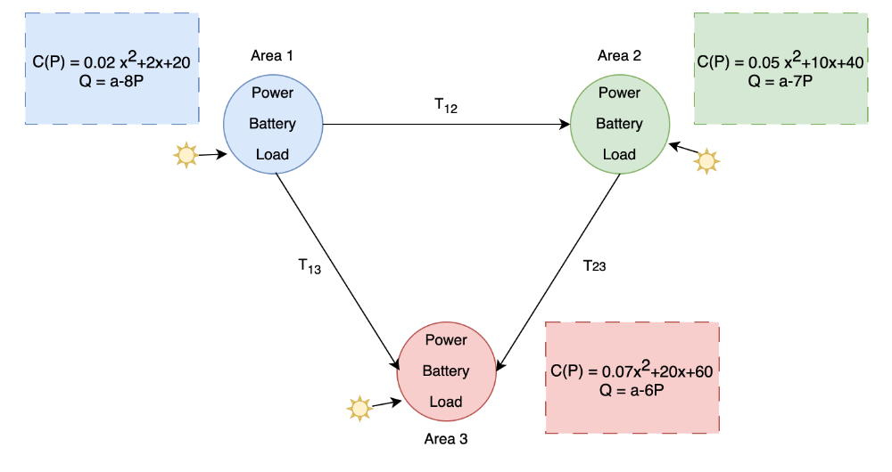
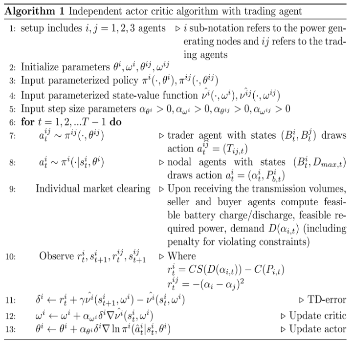
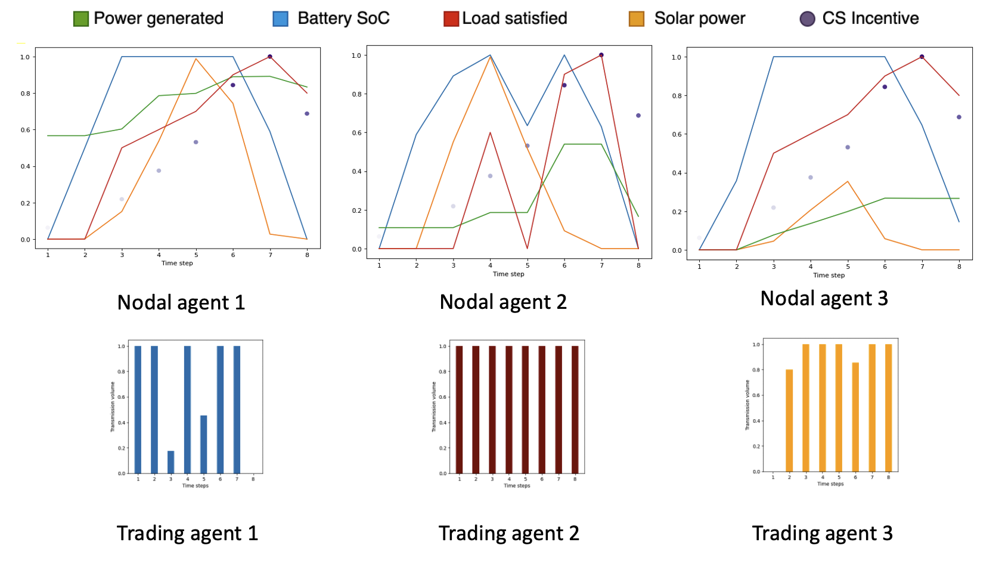

# Decentralized Energy Management with Deep Reinforcement Learning

This repository implements a decentralized energy management framework using Advantage Actor-Critic (A2C) reinforcement learning. It models multiple energy nodes with battery storage and solar input, enabling each node to make local decisions while coordinating energy transfers through trading agents.

---

## Problem Overview

Consider the operation of three agents in an interconnected power system with storage facility. The  agents are connected by a tie-line agent (trading agent) that decides and carries power flow, $T_{vol}$ from the sender agent to the receiving agent. The nodal agents include the power source, battery storage resource and a price-elastic demand. The generated unit power is denoted by $P \in [0,P_{max}]$, demand is given by $D(\alpha_t)$ and $B_t$ is the state of charge of the battery that can be charged / discharged as $\underline{P_{b}}$ $/$ $\overline{P_{b}}$. Additionally, each agent receives solar power denoted by $y_t$. The cost of producing $P$ units is given by the function $C(P)$ and the consumer surplus is given by $CS(D(\alpha_t))$.  

The objective function of each nodal agent is:
```math
\max_{P_{b,t},\alpha_t} \quad CS(D(\alpha_t)) - {C(P_t)}
```
s.t  
```math
T_{vol,t} = P_t - P_{b,t} -D(\alpha_t) + y_t
```
```math
B_{t+1} = B_t-P_{b,t}
```

```math
\underline{P_{b,t}} < P_{b,t} < \overline{P_{b,t}}
```

```math
    0 < P_t < P_{max}
```

```math
    y_t = p(t)+\epsilon_t 
```
where $p(t) = m_0+m_1t+m_2t^2$ , the coefficients $m_0,m_1,m_2$ are chosen such that $p(0) =0, p(T/2) = \mu, p(T) = 0$ and $log ~\epsilon_t \sim N(0,\sigma^2)$ 

The objective function for trading agent on the tie-line connecting nodal agent i and nodal agent j is:
```math
    \min_{T_{vol,t}}  \quad (\alpha_{i ,t}- \alpha_{j,t})^2
```
s.t 
```math
   0< T_{vol,t} <T_{vol,max}
```



---

## Multi-Agent Bi-Level Framework

### Lower Level (Nodal Agents)
- **Objective:** Maximize consumer surplus minus generation cost  
- **State:** `[Battery SoC, Estimated Max Demand]`  
- **Action:** `[Battery Power, Price]`  
- **Reward:** `CS(D(α)) - C(P) - Penalty`

### Upper Level (Trading Agents)
- **Objective:** Minimize price mismatch between connected nodes  
- **State:** `[SoC_i, SoC_j]`  
- **Action:** `Transfer Volume`  
- **Reward:** `-(α_i - α_j)^2 - Penalty`

---

## Algorithm

The model uses independent actor-critic agents for both node-level and trading-level decisions. Each agent updates its own policy and value network based on TD-error and market outcomes.



---

## Performance

The system is evaluated over 8 timesteps. Key metrics include:
- Power generation
- Battery usage
- Load satisfaction
- Consumer surplus incentive

Current performance is within 3–5% of a benchmark centralized solution.



---

## Solar Perturbations

Solar fluctuations are generated using a quadratic decay model with stochastic variation.

---
